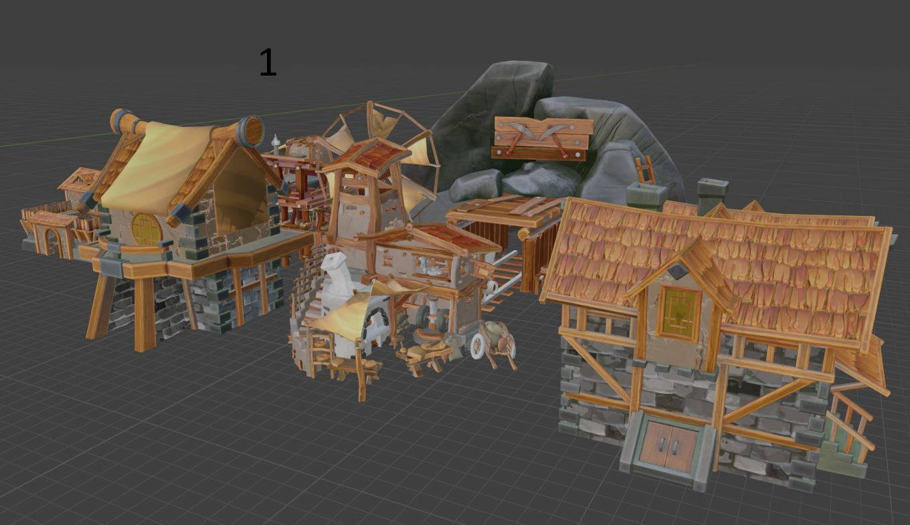

## Contact
For any questions or collaboration, please contact me at [hasanhw@gmail.com](mailto:hasanhw@gmail.com)

# Game Dev Portfolio

This portfolio showcases the games I have developed and the levels featuring 3D models.

## Games
### Game1
[**Devlog**](game1.md) 
**Description:** Game1 is a fast-paced action game. Players try to score high by overcoming various obstacles.

**Video:**
- [YouTube Video](https://www.youtube.com/watch?v=game1video)

**Screenshots:**
- 
- 

---
### Game2
[**Devlog**](game1.md)  
**Description:** Game2 is a puzzle adventure game focused on solving challenging puzzles across different levels.

**Video:**
- [YouTube Video](https://www.youtube.com/watch?v=game2video)

**Screenshots:**
- 
- 
- 

---
### Game3
[**Devlog**](game1.md)  
**Description:** Game3 is a multiplayer racing game. It offers a fun experience with various vehicles and tracks.

**Video:**
- [YouTube Video](https://www.youtube.com/watch?v=game3video)

**Screenshots:**
- 
- 

---

## 3D Models & Levels

### Level1
**Description:** Level1 is a collection of 3D models featuring a city environment.

**Screenshots:**
- 
- 

**3D Viewer:**
- [View 3D Model](https://sketchfab.com/3d-models/level1)

---

### Level2
**Description:** Level2 is a nature-themed 3D model set.

**Screenshots:**
- 
- 

**3D Viewer:**
- [View 3D Model](https://sketchfab.com/3d-models/level2)

---

